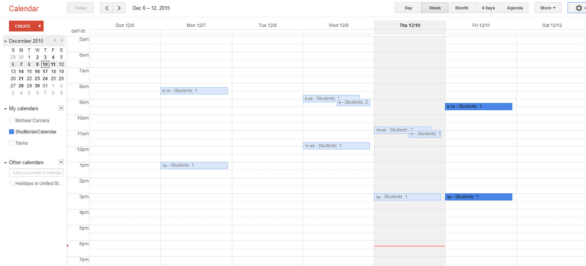
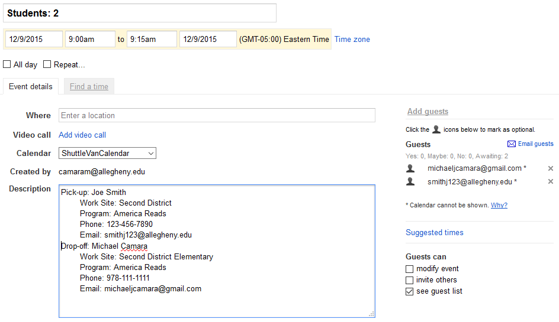
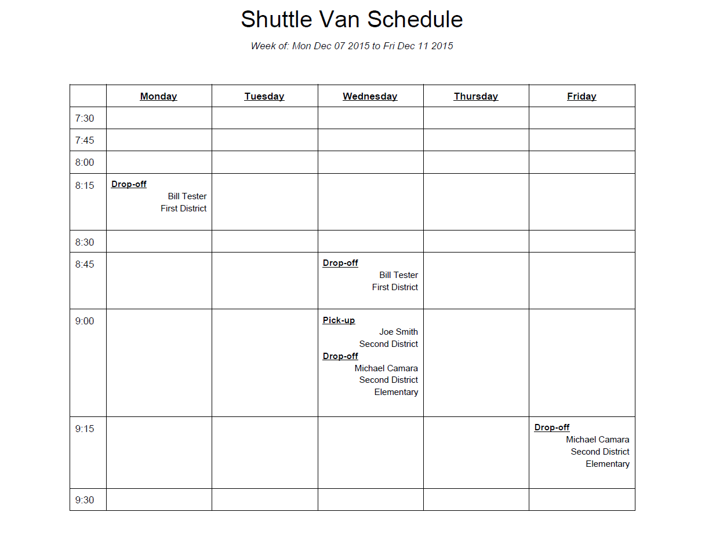
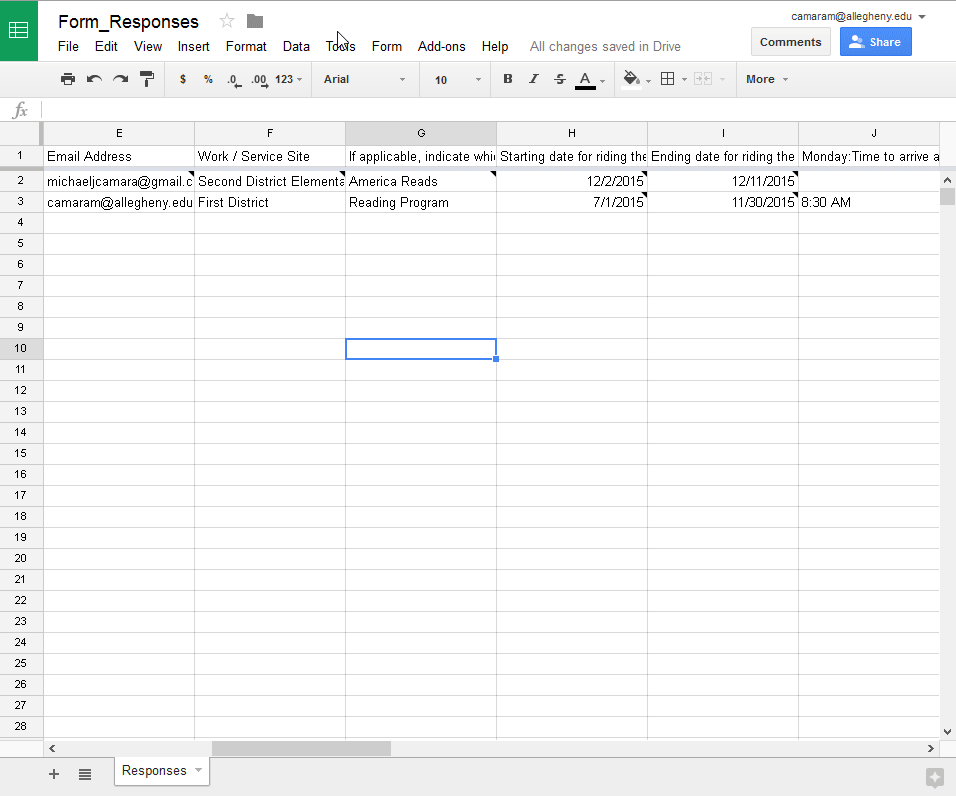

#VanGo README

## Table of Contents
+ [What is VanGo?](#what)
+ [The VanGo Process](#process)
	- [The Google Form](#form)
	- [The Google Sheet](#sheet)
	- [The Google Calendar](#calendar)
	- [The Google Doc](#table)
+ [Tutorial](#tutorial)
	- [Access and Edit VanGoScript](#access)
	- [deleteAllEvents Function](#deleteallevents)
	- [removeStudentFromEvents Function](#removestudentfromevents)
	- [addStudentToEvent Function](#addstudenttoevent)
	- [clearScheduleTable Function](#clearscheduletable)
	- [updateScheduleTable Function](#updatescheduletable)
+ [Why Choose VanGo?](#why)
+ [Contributors](#contributors)

## What is VanGo? 

VanGo is a custom scheduling system for the Allegheny Shuttle Van Service.  It integrates with several well-known Google products to provide an automatic, light-weight solution for scheduling students in an organized way.  It further provides two distinct forms of output: a Google Calendar that allows one to view the unique schedule for each week of the year, and an easily printable Google Doc that provides a more clear look at the current week.  This ReadMe will discuss the entire scheduling process used by VanGo, and the few instructions you'll need to easily maintain the schedule for long-term use.

## The VanGo Process 
VanGo continues to use Google Forms and Google Sheets to retrieve and store scheduling requests from students.  It then uses this information to produce both a Google Calendar and Google Doc to reflect these requests.

### The Google Form (ShuttleVanForm) 
The newly created Google Form, currently called ShuttleVanForm, can be found at the following URL: https://docs.google.com/a/allegheny.edu/forms/d/1aTNVBvwU8JhAF5eqtEkrBQfcxoUCxXZFkYVp3ptMz30/viewform.

Google Forms provide an easy and customizable means of collecting information from students, so VanGo continues to utilize this approach.  Much of the same content was kept from the previous version of the form, but a few notable updates were made:

1.  *__Enforced Login__*

	Students will now be required to log into their GMail account in order to use the form.  This has the secondary effect of allowing only one active form submission per student.  This should provide the following positive effects: first, students will be unable to produce duplicate scheduling requests, which would otherwise result in many erroneous entries into the schedule.  Second, the student's form submission is saved and easily accessible to them: if they do need to adjust any of the information they submitted, they can easily re-open the same form and change what they need to.
	
2.  *__Start Date and End Date__*

	The previous form only permitted the student to enter their desired start date.  This was expanded by requiring the student to enter their desired end date as well.  This allows VanGo to create dynamic, weekly schedules, instead of broad semester schedules.  Each week can now reflect new students beginning the shuttle service and existing students leaving the service at any time.  This should further allow drivers to be confident that the schedule for a given week is accurate, as it should no longer include students who have not specifically requested the shuttle for that particular week.  

3.  *__15 Minute Time Intervals__*
	
	The old form allowed the student to select any time throughout the entire day.  While this granted the student great flexibility, it introduced many conflicts as well.  Multiple students could schedule around the same time, and then the scheduler would need to find the best time to fit them all on the shuttle.  This might also force the scheduler to contact multiple students individually to assess their availability for adjusted times.  It further could permit the student to schedule the shuttle for times when the service would not be provided (i.e. too early in the morning or late at night).  To address these issues, we changed the time selection on the form to a drop-down menu with specific 15 minute intervals throughout the day, from 7:30AM to 5:45PM.  This should provide significant structure to the scheduling process, and we believe that students should be able to accommodate their schedules to this structure in most cases.

4.  *__Other Minor Changes__*
	
	Additionally, the "Name" field has been divided into "First Name" and "Last Name" fields.  Previous form submissions revealed that students would occasionally omit their last name from the field when only one box was provided; this should hopefully address that rare problem.  Additionally, data validation was added to the "Phone Number" field in order to comply with a specific format.  This was done to help standardize the input and ensure that all information is entered as intended.
	
### The Google Sheet (Form_Responses) 
The newly created Google Sheet, currently called Form_Responses, can be found at the following URL: https://docs.google.com/spreadsheets/d/1qjh1UbBCpMU0obs-D6CP6WFEYRkZBZ7GXn-jp6SUeus/edit#gid=1266965723.

Once the student submits the ShuttleVanForm, the information from that form automatically populates a row in the Form_Responses Google Sheet.  VanGo has been implemented as a script that has been integrated directly into this Google Sheet: it will activate automatically when the sheet updates with new values.  The contents of this sheet should typically not be altered directly.  See the [Tutorial](#tutorial) section for instructions on how to access the VanGo script and perform some maintenance options if needed (e.g. removing specific students from the calendar, deleting large volumes of events, etc).

### The Google Calendar (ShuttleVanCalendar) 
The Google Calendar, currently called ShuttleVanCalendar, can be found at the following URL: https://www.google.com/calendar/embed?src=allegheny.edu_93fhcf7oq8i7771q4ehm76k814%40group.calendar.google.com&ctz=America/New_York.

Once the ShuttleVanForm is submitted, the information automatically enters into the Form_Responses sheet, and then VanGo automatically begins updating the ShuttleVanCalendar: absolutely no user input is required for this to happen.  VanGo will begin looking at the ShuttleVanCalendar from the student's indicated start date, traversing each day until it reaches the indicated end date.  It will find the time slots indicated for drop-off or pick-up, Monday through Friday, and check whether each time slot is already occupied.  If no one has already been scheduled for a particular time slot, then VanGo will create a new 15 minute event on the calendar, add the student as a guest, and provide a formatted description that includes: the type of scheduling request (drop-off or pick-up), the student's name, work site, program, phone number, and email address.  If an event already exists for the desired time slot, then VanGo will likewise add the student to that event and update the description such that all of the students' information is neatly arranged in the description window.

Finally, if an event exists for the time slot with six student guests already scheduled, then the current student *will not* be added to that event.  This restriction was implemented due to the six seat limitation of the Allegheny shuttle van, and the first-come first-serve nature of the service.  Instead of arbitrarily choosing a different time to schedule the student, VanGo will instead automatically send an email to the student indicating him/her of this conflict.  The email displays the conflicting time (or times), and then provides a link that the student can follow back to their saved form submission.  They can then open their form (which retains all of the previously entered information), choose a new 15 minute time slot that works for them, and resubmit it.  This entire process should happen within just a few minutes of the form submission, so the student will receive a very quick indication of this conflict and have ample time to select a time that works for both him/her and the shuttle service.  Contact information for Mr. Scandinaro is further provided in the email, in case the student requires any special accommodation.

Sample output from the ShuttleVanCalendar (weekly view)

Sample output from the ShuttleVanCalendar (event details)

### The Google Doc (ShuttleVanTable) 
The Google Doc, currently called ShuttleVanTable, can be found at the following URL: https://docs.google.com/document/d/1CKWk5bT8n5h2-Dx__9LANFMpvFUUIalmx06inaGC7xk/.

While the ShuttleVanCalendar allows great granularity for scheduling students at different times and viewing the overall schedule for any desired week, it suffers from having poor print quality.  The default print settings offered by Google Calendar do not display all of the details for the calendar events, and much of the important information is lost.  In order to resolve this issue, and allow for a suitable schedule that can be printed, VanGo additionally creates the ShuttleVanTable.  Currently, VanGo is scheduled to update this ShuttleVanTable every night at midnight automatically.  It will gather information from the ShuttleVanCalendar for just the current week (Monday through Friday), and create a table the displays all of the scheduled events for the week.  The table is divided into rows that display the 15 minute intervals from 7:30AM to 5:45PM, and further has five columns for Monday through Friday.  In order to keep the table legible and succinct, only the most important features of each event are included in the output: the type of event (pick-up or drop-off), the student's name, and the work site.  This table can then be easily printed and distributed to drivers, particularly if they do not have access to the online ShuttleVanCalendar.

Sample output from the ShuttleVanTable (only morning schedule displayed)

## Tutorial 
In most cases, VanGo should not require any input from the user.  It should operate automatically, producing both the ShuttleVanCalendar and ShuttleVanTable as output.  However, certain features have been added to VanGo to allow the user additional manual control over the scheduling process.

### Access and Edit VanGoScript 
This section shows how to open the VanGoScript and activate the available features, which are detailed in the following section.  Also see the embedded GIF for a quick demonstration.

1.  Go to the [Form_Responses Google Sheet](https://docs.google.com/spreadsheets/d/1qjh1UbBCpMU0obs-D6CP6WFEYRkZBZ7GXn-jp6SUeus/edit#gid=1266965723).
2.  Click on the `Tools` menu button and select `Script editor..`
3.  In the new window, the `Util.gs` file will automatically open.  Scroll down to the function you want to use (see below for details!)
4.  Edit the text in the file as specified in the code comments, and in the descriptions below.
5.  Click the `Run` menu button and select the name of the function you want to run.
6.  A pop-up will appear with "Running function <name_here>...", which will disappear once the operation finishes.
7.  If a pop-up requests permission to use the services provided by Google, click `Allow`.

Visual demonstration of above steps for opening and editing VanGoScript

### deleteAllEvents Function 
This function will delete all events on the ShuttleVanCalendar between two dates.  This will be much quicker and more efficient than manually removing each event; but be aware that this cannot be undone.

1.  Edit the `var startDate = "";` statement on line 19, and the `var endDate = "";` statement on line 20.
2.  Between the quotation marks, put valid dates in the format: "MM/DD/YYYY"
3.  Example:

		var startDate = "11/01/2015";
		var endDate = "11/21/2015";
4.  Click the `Run` menu button, then select `deleteAllEvents`

### removeStudentFromEvents Function 
This function will look through the calendar for a particular student.  It will delete any events where this student is the only guest, and it will otherwise remove the student from an event if other students are scheduled as well.

1.  Edit the `var email = "";` statement on line 53.
2.  Between the quotation marks, put the email of the student you wish to remove from the schedule.
3.  Example:
		
		var email = "camaram@allegheny.edu";
4.  Click the `Run` menu button, then select `removeStudentFromEvents`

### addStudentToEvent Function 
This function will add a student to a particular event in the schedule.  This will bypass the restriction that otherwise prevents students from joining an event that already has 6 guests.  Currently this only adds the student to one event and not multiple events.

1.  Edit all `var` statements between line 130 and line 139: starting with `firstName` and ending with `endTime`.
2.  Carefully enter all of the student's information in between each set of quotation marks.  This is the same type of information the student would enter in the ShuttleVanForm.
3.  Example: (Comments have been added to the right for added clarity)

		var firstName = "Joe";
 		var lastName = "Smith";
 		var phone = "123-456-7890";
 		var email = "smithj123@allegheny.edu";
 		var site = "Second District";
 		var program = "America Reads";
 		var typeOfEvent = "Drop-off";  		// (or "Pick-up")
 		var targetDate = "12/09/2015"; 		// ("MM/DD/YYYY")
 		var startTime = "9:00 AM";			// ("HH:SS AM" or "HH:SS PM")
 		var endTime = "9:15 AM";			// ("HH:SS AM" or "HH:SS PM")
4.  Click the `Run` menu button, then select `addStudentToEvent`

### clearScheduleTable Function 
This function clears all entries from the ShuttleVanTable Google Doc.  This is equivalent to opening the document and manually deleting everything; but this might prove more convenient.

1.  No editing needed!
2.  Click the `Run` menu button, then select `clearScheduleTable`

### updateScheduleTable Function 
This function forces the ShuttleVanTable Google Doc to update.  Normally the table is updated every day at midnight; but if you need it to reflect the most recent changes from the day, use this function.

1.  No editing needed!
2.  Click the `Run` menu button, then select `updateScheduleTable`	  

## Why Choose VanGo? 

1.  *__Real-time, automatic scheduling__*
	
	The VanGo system works without the need for user input.  Students submit their ShuttleVanForm online, and VanGo takes care of the rest.  It will further automatically send students notifications about their upcoming scheduled events, helping to ensure that no one misses their ride.
	
2.  *__Extremely light-weight system__*
	
	Once you have access to the 4 VanGo Google files (the form, sheet, calendar, and doc), then you're all set.  There are no complicated installers you need to use or additional external files to download.  Just provide students with the link to the form and you can immediately start using VanGo.
	
3.  *__Automatic conflict resolution__*

	VanGo helps prevent many conflicts through the modified ShuttleVanForm, and further helps resolve scheduling conflicts by automatically emailing affected students.
	
4.  *__Familiarity of Google__*
	
	The Google line of products are ubiquitous and easy to understand for both Allegheny staff and students alike.
	
5.  *__Two sources of output__*
	
	The VanScheduleCalendar allows the user to look at the schedule for any day and any week of the year, while also providing detailed student information in every scheduled event.  Additionally, the VanScheduleTable gives the user a high-quality, printable weekly schedule that can easily be distributed to drivers or other affected parties.
	
6.  *__Maintain ability to edit the schedule, if needed__*

	Although VanGo should not require regular input from the user, it still provides a number of utility functions to allow the user to edit the schedule, if needed.

Ultimately, we are confident that VanGo can be used to help the Allegheny Shuttle Van Service manage its schedule in an organized and efficient way.  Furthermore, if chosen for this purpose, we would continue to offer additional features, maintenance, and support to ensure the longevity of this product.

## Contributors 
Michael Camara [michaeljcamara](https://github.com/michaeljcamara)

Herbie Torrance

Cathal Chaffee
 
Victor Zheng [victorhz](https://github.com/victorhz)

Alex Means [meansa](https://github.com/meansa)

Francis Craft [craftfrancis](https://github.com/craftfrancis)